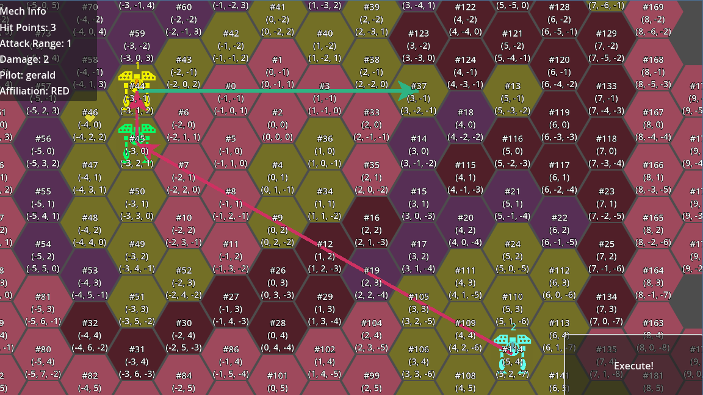

# Confetticore

- Turn-based tactics game serving as a exercise in code architecture and project management.
- Give Orders to Units in Planning Phase.
- Watch them act out these Orders in Execution Phase
- Execution Phase simulates Units' moves simultaneously on a Hexagonal tile map.
- Units - Mechs controlled by Pilots - adjust their actions based on the situation - similar to auto battler games.

## Disclaimer
This was my first attempt learning the Model-View-Presenter pattern to structure a kind of strategy game.   
The main goal was to practice cleaner clode structure, separating logic from presentation.   
Hence, there's little actual gameplay functionality.   

I wrestled with many technical questions developing my own understanding of it.   
This is evident by the sprawling documentation, including a lengthy dev diary.   
This was also a  exercise in project documentation, mainly TDD and Scrum Board + Backlog.   

Mistakes were made, such as misusing the term "chain-of-responsibility" where "wrapper" or "facade" may have been more appropriate.   
That's because I'm using it mostly in the context of nested classes or specifically Godot's scene trees, where it's often referred to as the "Signal-up-Call-down principle".   

## Learning Goals
Basically I want to practice cleaner code structure.
Specifically, I am working on a rigorous Model-View-Presenter implementation to separate game logic from presentation.
A strategy game lends itself very well to it.
I'm using concepts such as Data Transfer Objects and Chain of Responsibility.

## Future Feature Goals
- Unit Pilots will have a Psyche system, allowing them to re-interpret Orders and select preferred Strategies based on assessment on their current situation.
- Psyche system includes social relationships between pilots. E.g. overriding and going against an order to help a friend in dire straits.

## Documentation
- [Technical Design Document](https://docs.google.com/document/d/14xsRx_NeKTQH0zKv_amdp5cuLRJw7PbQz_LWp2n0DBo/edit?usp=drive_link)
- [TDD Diagrams](https://drive.google.com/file/d/16xqOg87J9RUO1X9MrZPc5XjdYffG2_wZ/view?usp=sharing)
- [Project Management with Taiga](https://tree.taiga.io/project/gerald_as-confetticore)
- [Production Document](https://docs.google.com/document/d/1UwyHf1eg3D7vivbMB-8hrbXGqYYesqqeyvpzFDUtX_w/edit?usp=drive_link)
- [Game Design Document](https://docs.google.com/document/d/1S1yylPZWGxEKbrGrr7b4o4ZVpSo6_vDY479FvE0vAE4/edit?usp=drive_link)

## Key Facts
- Godot 4.4
- uses Zehir's [Hexagonal TileMapLayer](https://godotengine.org/asset-library/asset/3733) add-on
- ~2 months
